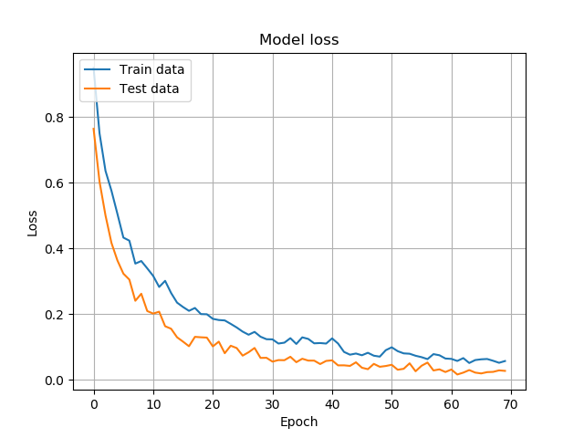
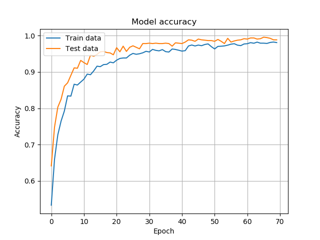
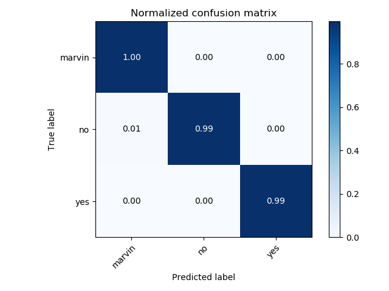
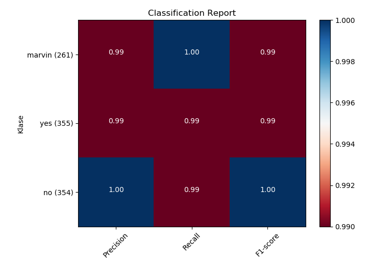

# Speech-commands-recognition

Three-word classification
"Yes", "No" and "Marvin"

Data acquired from Tensorflow: http://download.tensorflow.org/data/speech_commands_v0.01.tar.gz

2 versions:
  - sr.progr.py
  - SR-LSTM.py

Features: Zero Crossing Rate, MFCC, Spectral Centroid, Spectral Rolloff

Neural network: Long Short Term Memory

Explanation of LSTM neural network: http://colah.github.io/posts/2015-08-Understanding-LSTMs/
## SR-LSTM.py

#### Model loss

#### Model accuracy

#### Confusion matrix

#### Classification report

Acquired by using code from: https://stackoverflow.com/questions/28200786/how-to-plot-scikit-learn-classification-report

